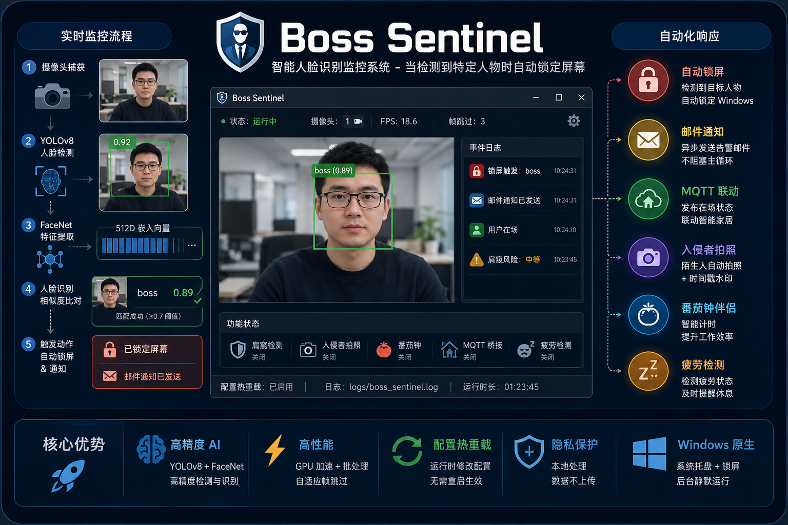

<div align="center">

# 🛡️ Boss Sentinel

**智能人脸识别监控系统 - 当检测到特定人物时自动锁定屏幕**

[](https://www.python.org/)
[](https://www.microsoft.com/windows)
[](LICENSE)
[](https://docs.astral.sh/uv/)

[功能特性](#-功能特性) • [快速开始](#-快速开始) • [配置](#-配置说明) • [开发](#-开发)

</div>

<p align="center">
  
</p>

<p align="center">
  <em>🔍 Apple 风格 Web UI — 实时人脸检测与识别</em>
</p>

---

## 📖 简介

Boss Sentinel 是一个基于深度学习的 Windows 人脸识别监控系统。它使用 YOLOv8 进行实时人脸检测，FaceNet 进行高精度人脸识别，当检测到预先设定的目标人物时会自动锁定电脑屏幕。系统提供 **Apple 官网风格的 Web UI**，通过浏览器即可完成所有操作，界面现代美观。系统引入 **身份角色系统**（主人/Boss/同事/陌生人），不同角色触发不同的功能行为。除了核心的监控功能外，还提供了头部姿态追踪、肩窥检测、入侵者拍照、番茄工作法、智能家居联动等丰富的扩展功能。

> ⚠️ **免责声明**：本项目仅供学习和娱乐目的，请勿用于任何非法用途。

## ✨ 功能特性

### 核心功能

| 功能 | 描述 |
|------|------|
| 🔍 **实时人脸检测** | 基于 YOLOv8 的高精度人脸检测，支持多摄像头，GPU/FP16 加速 |
| 🎯 **多人物识别** | FaceNet 512D 嵌入 + 余弦相似度，支持人脸对齐、批处理推理 |
| 🚀 **智能跟踪** | 每摄像头独立跟踪器，识别缓存减少重复计算 |
| 🔒 **自动锁屏** | 检测到 Boss 角色时自动锁定 Windows，支持目标名单过滤和运行时开关 |
| 📧 **邮件通知** | SMTP/SMTP_SSL 邮件报警，异步发送不阻塞主循环 |
| 🌐 **Web UI** | Apple 官网风格深色主题界面，MJPEG 实时视频流，SSE 日志推送，浏览器通知告警 |
| 👤 **身份角色** | 主人/Boss/同事/陌生人四种角色，不同角色触发不同功能行为 |
| 🔥 **配置热重载** | 运行时修改配置自动生效，无需重启 |
| ⚡ **性能优化** | 自适应帧跳过、GPU 加速、批处理推理、向量化的嵌入比较 |

### 🎯 扩展功能（可选，默认关闭）

| 功能 | 描述 |
|------|------|
| 👁️ **注意力追踪** | 基于 YOLOv8 5关键点的头部姿态估计（solvePnP），追踪专注度/分心/离开状态 |
| 🛡️ **肩窥探测器** | 检测身后有陌生人偷看屏幕，计算隐私等级，角色感知授权名单 |
| 📸 **入侵者拍照** | 主人离开期间检测到陌生人自动拍照 + 时间戳水印 |
| 🍅 **番茄钟伴侣** | 主人坐下自动开始专注计时，Boss 出现自动暂停（会议模式），每日效率报告 |
| 🏠 **MQTT 智能家居** | 发布在场状态到 MQTT，联动 Home Assistant 自动化灯光/空调 |
| 😴 **疲劳检测** | 追踪眼睛纵横比（EAR），检测犯困（旧版，精度有限，推荐使用注意力追踪） |

## 🚀 快速开始

### 安装

```bash
# 克隆仓库
git clone https://github.com/yourusername/Anti-BossShield.git
cd Anti-BossShield

# 使用 uv 安装依赖（推荐）
uv sync

# 或使用 pip
pip install -e .
```

### 可选依赖

```bash
# MQTT 智能家居功能
pip install paho-mqtt

# 高精度疲劳检测（不安装也能用 YOLOv8 关键点近似）
pip install mediapipe
```

### 配置

1. **创建配置文件**
   ```bash
   cp config.json.example config.json
   ```

2. **准备人脸图片并分配角色**
   ```
   known_faces/
   ├── stanley/           # 主人（在 Web UI 中分配 "主人" 角色）
   │   ├── photo1.jpg
   │   └── photo2.jpg
   ├── boss_name/         # Boss（分配 "Boss" 角色 → 触发锁屏）
   │   └── photo1.jpg
   └── coworker/          # 同事（分配 "同事" 角色 → 无特殊动作）
       └── photo1.jpg
   ```

   > 角色在 Web UI 的「系统配置 → 👤 身份角色」面板中分配，无需手动编辑文件。

### 运行

**Web UI 模式（推荐）— 自动打开浏览器：**
```bash
python -m boss_sentinel
```

启动后自动在浏览器打开 `http://localhost:8970`，展示 Apple 风格的监控界面。

**命令行模式（无 UI）：**
```bash
python -m boss_sentinel.main
```

## 🖥️ Web UI

Boss Sentinel 提供 Apple 官网风格的 Web 界面，主要包含以下区域：

| 区域 | 功能 |
|------|------|
| **Hero 状态栏** | 监控状态指示（绿色/红色/橙色）、启动/停止按钮、锁屏开关 |
| **实时监控** | MJPEG 视频流实时预览，FPS 和在线状态徽章 |
| **功能仪表板** | 番茄钟倒计时环、注意力追踪（专注/分心/离开）、隐私保护状态指示器 |
| **身份角色** | 为已知人脸分配主人/Boss/同事角色，不同角色驱动不同功能 |
| **系统配置** | 手风琴式配置面板 — 身份角色、基础配置、邮件通知、扩展特性 |
| **检测日志** | 终端风格日志面板，SSE 实时推送，检测告警红色高亮 |
| **告警系统** | 屏幕红色闪烁 + 浏览器通知 + 音频提示 |

**技术栈：** FastAPI + 纯 HTML/CSS/JS（零前端框架依赖）

## ⚙️ 配置说明

### 核心参数

| 参数 | 默认值 | 说明 |
|------|--------|------|
| `known_faces_dir` | `known_faces` | 人脸图片目录 |
| `model_path` | `yolov8n-face.pt` | YOLO 模型路径 |
| `threshold` | `0.7` | 人脸识别相似度阈值 (0.0-1.0) |
| `confidence_threshold` | `0.7` | 检测置信度阈值 |
| `frame_skip` | `3` | 帧跳过数，越大性能越好但响应变慢 |
| `use_gpu` | `true` | 是否使用 GPU 加速 |
| `lock_cooldown` | `30` | 锁屏冷却秒数 |
| `notify_cooldown` | `60` | 同一人通知冷却秒数 |
| `cameras` | `[0]` | 摄像头 ID 列表 |
| `show_feed` | `true` | 是否显示摄像头画面 |
| `target_names` | `[]` | 触发锁屏的目标名单（空=所有人） |
| `tracker_max_disappeared` | `30` | 跟踪器消失帧数阈值 |
| `away_timeout` | `30.0` | 用户离开多少秒视为不在场 |

### 扩展功能参数

| 参数 | 默认值 | 说明 |
|------|--------|------|
| `enable_shoulder_surfing` | `false` | 启用肩窥检测 |
| `enable_intruder_capture` | `false` | 启用入侵者拍照 |
| `enable_pomodoro` | `false` | 启用番茄工作法计时 |
| `enable_mqtt` | `false` | 启用 MQTT 智能家居桥接 |
| `enable_head_pose` | `false` | 启用注意力追踪（头部姿态估计） |
| `enable_drowsiness` | `false` | 启用疲劳检测（旧版） |
| `mqtt_broker` | `""` | MQTT broker 地址 |
| `mqtt_port` | `1883` | MQTT broker 端口 |
| `mqtt_topic_prefix` | `"boss_sentinel"` | MQTT 主题前缀 |
| `pomodoro_focus_minutes` | `25` | 番茄钟专注时长（分钟） |
| `pomodoro_break_minutes` | `5` | 番茄钟休息时长（分钟） |
| `intruder_save_dir` | `"intruder_photos"` | 入侵者照片保存目录 |
| `head_pose_alert_threshold` | `30.0` | 头部偏转角度阈值（度） |
| `roles` | `{"owner":[],"boss":[]}` | 角色分配：owner=主人, boss=触发锁屏, colleague=同事 |

## 📁 项目结构

```
boss_sentinel/
├── __init__.py
├── __main__.py            # 包入口（Web UI 启动 + 中文路径修复）
├── config.py              # 配置管理 + 热重载 + 验证
├── detector.py            # YOLOv8 人脸检测（GPU/FP16 + 关键点）
├── recognizer.py          # FaceNet 人脸识别（批处理 + 对齐 + 向量化）
├── tracker.py             # 人脸跟踪 + 识别缓存
├── monitor.py             # 主监控逻辑（角色感知 + 自适应帧跳过）
├── role_manager.py        # 👤 角色管理（owner/boss/colleague/unknown）
├── head_pose.py           # 👁️ 头部姿态估计（solvePnP + 注意力追踪）
├── locker.py              # Windows 锁屏 (LockWorkStation)
├── notifier.py            # 邮件通知（SMTP/SMTP_SSL + 异步）
├── logger.py              # 日志记录（RotatingFileHandler）
├── main.py                # CLI 入口（支持 --web 切换 Web UI）
├── web/                   # 🌐 Web UI
│   ├── server.py          # FastAPI 后端（REST API + MJPEG + SSE）
│   └── static/
│       ├── index.html     # Apple 风格单页应用
│       ├── style.css      # 深色主题 + 毛玻璃效果 + 角色徽章 + 响应式
│       └── app.js         # 前端交互（角色管理 + SSE + 通知 + 音频）
├── shoulder_surfing.py    # 🛡️ 肩窥探测器（角色感知授权名单）
├── intruder_capture.py    # 📸 入侵者拍照（仅陌生人触发）
├── pomodoro.py            # 🍅 番茄钟伴侣（主人驱动，Boss 暂停）
├── mqtt_bridge.py         # 🏠 MQTT 智能家居桥接
└── drowsiness_detector.py # 😴 疲劳检测（旧版，精度有限）

tests/                     # 单元测试
```

## 🔧 开发

### 运行测试

```bash
uv run pytest tests/ -v
```

### 打包为 EXE

```bash
uv run pyinstaller BossSentinel.spec
```

生成的可执行文件位于 `dist/BossSentinel/` 目录。运行后自动启动 Web 服务器并打开浏览器。

## 💻 系统要求

- **操作系统**: Windows 10/11
- **Python**: 3.9 - 3.12
- **浏览器**: Chrome / Edge / Firefox（现代浏览器）
- **包管理**: [uv](https://docs.astral.sh/uv/)（推荐）或 pip
- **硬件**: 摄像头（必需）、CUDA 兼容 GPU（可选，用于加速）
- **可选**: paho-mqtt（MQTT 功能）、mediapipe（高精度疲劳检测，旧版功能）

## 📝 注意事项

- 首次运行会自动下载 `yolov8n-face.pt` 模型（约 6MB）
- 配置文件 `config.json` 不会提交到 Git，请从示例文件复制
- 日志文件自动轮转（最大 1MB，保留 5 个备份）
- 所有扩展功能默认关闭，需在 config.json 或 Web UI 中手动启用
- 可选依赖缺失时功能会被静默禁用并记录警告日志
- Web UI 默认监听 `http://localhost:8970`，可在代码中修改端口

## 🤝 贡献

欢迎提交 Issue 和 Pull Request！

1. Fork 本仓库
2. 创建特性分支 (`git checkout -b feature/AmazingFeature`)
3. 提交更改 (`git commit -m 'Add some AmazingFeature'`)
4. 推送到分支 (`git push origin feature/AmazingFeature`)
5. 提交 Pull Request

## 📄 License

本项目采用 MIT 许可证 - 详见 [LICENSE](LICENSE) 文件

## 🙏 致谢

- [YOLOv8](https://github.com/ultralytics/ultralytics) - 人脸检测
- [FaceNet PyTorch](https://github.com/timesler/facenet-pytorch) - 人脸识别
- [FastAPI](https://fastapi.tiangolo.com/) - Web 后端框架
- [Uvicorn](https://www.uvicorn.org/) - ASGI 服务器
- [paho-mqtt](https://www.eclipse.org/paho/python.php) - MQTT 通信
- [MediaPipe](https://mediapipe.dev/) - 面部网格（疲劳检测）

---

<div align="center">

**⭐ 如果这个项目对你有帮助，请给一个 Star！⭐**

</div>
